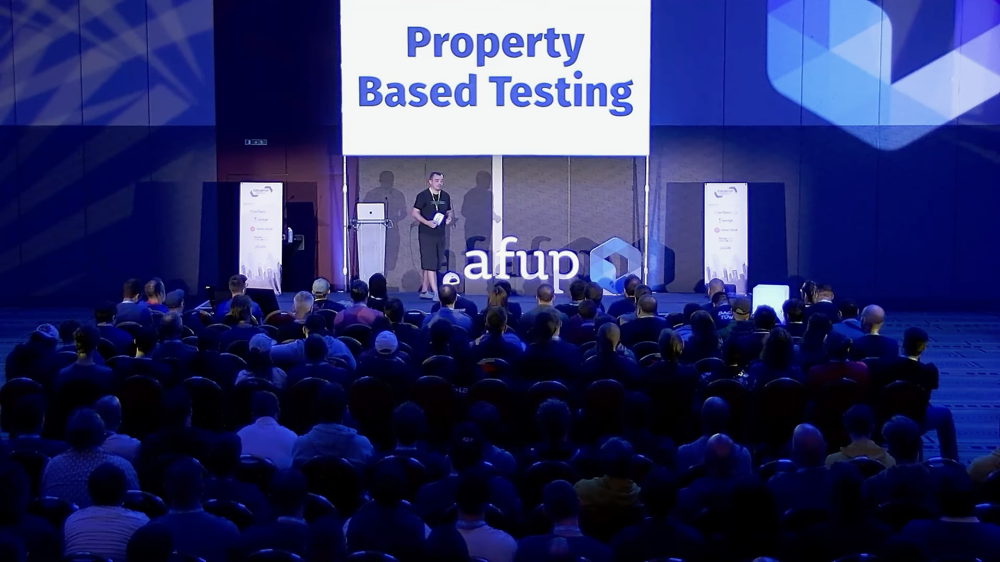
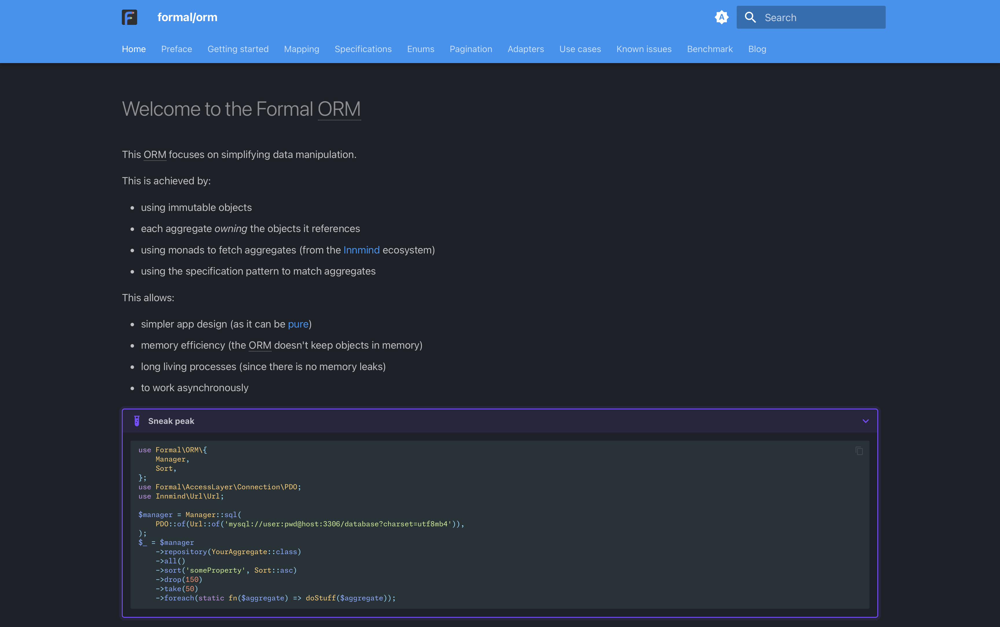

autoscale: true
theme: Fira, 6

## Et si on repensait les ORMs ?

---

[.list: alignment(left)]

- Baptiste Langlade
- Architecte chez Efalia
- Lyon
- ~95 packages Open Source
- 10+ ans XP

---

### Domain Driven Design

^ résoud problèmes maintenance

---

Une `Voiture` a une `CarteGrise`

^ la carte ne peut pas être partagée

---

```php
class Voiture
{
    public function __construct(
        private CarteGrise $carteGrise,
    ) {}
}

class CarteGrise
{
    public function __construct(
        private string $immatriculation,
        private string $proprietaire,
        private string $adresse,
    ) {}
}
```

---

[.code-highlight: 3, 12]

```php
class Voiture
{
    private int $id;

    public function __construct(
        private CarteGrise $carteGrise,
    ) {}
}

class CarteGrise
{
    private int $id;

    public function __construct(
        private string $immatriculation,
        private string $proprietaire,
        private string $adresse,
    ) {}
}
```

^ problème : chaque objet est obligé d'avoir un id pour identifier la ligne en bdd

---

[.code-highlight: 6]

```php
class Voiture
{
    private int $id;

    public function __construct(
        private CarteGrise $carteGrise,
    ) {}
}

class CarteGrise
{
    private int $id;

    public function __construct(
        private string $immatriculation,
        private string $proprietaire,
        private string $adresse,
    ) {}
}
```

^ problème : carte grise peut être partagée

---

[.code-highlight: 4, 7-9, 11, 20]

```php
class Voiture
{
    private int $id;
    private CarteGrise $carteGrise;

    public function __construct(
        string $immatriculation,
        string $proprietaire,
        string $adresse,
    ) {
        $this->carteGrise = new CarteGrise($this, $immatriculation, $proprietaire, $adresse);
    }
}

class CarteGrise
{
    private int $id;

    public function __construct(
        Voiture $voiture,
        private string $immatriculation,
        private string $proprietaire,
        private string $adresse,
    ) {}
}
```

^ problème : référence circulaire, transition problème de mémoire

---

---

```php
use Doctrine\ORM\EntityManagerInterface;

function (EntityManagerInterface $manager) {
    $entities = $manager
        ->getRepository(Voiture::class)
        ->findAll();
}
```

^ problème : fuite mémoire

---

[.code-highlight: 7-12]

```php
use Doctrine\ORM\EntityManagerInterface;

function (EntityManagerInterface $manager) {
    $repository = $manager->getRepository(Voiture::class);
    $count = $repository->count();

    for ($offset = 0; $offset < $count; $offset += 100) {
        $entities = $repository->findBy(
            limit: 100,
            offset: $offset,
        );
    }
}
```

^ problème : fuite mémoire

---

[.code-highlight: 8]

```php
use Doctrine\ORM\EntityManagerInterface;

function (EntityManagerInterface $manager) {
    $repository = $manager->getRepository(Voiture::class);
    $count = $repository->count();

    for ($offset = 0; $offset < $count; $offset += 100) {
        $manager->clear();
        $entities = $repository->findBy(
            limit: 100,
            offset: $offset,
        );
    }
}
```

^ problème : gérer localement un état global

---

^ "Ces problèmes, et il en existe d'autres, sont inextricables du design des orms actuels. Et si on repensait ce design ?"

---

## Arrive Formal !

^ ORM orienté DDD

---

```sh
composer require formal/orm
```

---

```php
use Formal\ORM\Id;

final readonly class Voiture
{
    /** @param Id<self> $id */
    public function __construct(
        private Id $id,
        private CarteGrise $carteGrise,
    ) {}
}
```

```php
final readonly class CarteGrise
{
    public function __construct(
        private string $immatriculation,
        private string $proprietaire,
        private string $adresse,
    ) {}
}
```

^ Immuable

---

```php
$carteGrise = new CarteGrise('aa-123-bb', 'John Doe', 'Somewhereville');
$voiture1 = new Voiture(
    Id::new(Voiture::class),
    $carteGrise,
);
$voiture2 = new Voiture(
    Id::new(Voiture::class),
    $carteGrise,
);
```

^ 2 cartes persistées, rend explicite la nécessité d'ajouter une vérification

---

[.code-highlight: 3-5, 8-9]

```php
use Innmind\Immutable\Either;

$repository = $manager->repository(Voiture::class);
$manager->transactional(
    static function() use ($repository) {
        $voiture1 = ...;
        $voiture2 = ...;
        $repository->put($voiture1);
        $repository->put($voiture2);

        return Either::right(null);
    },
);
```

^ transaction permet de faire les appels sql directement

---

[.code-highlight: 7-8]

```php
use Innmind\Immutable\Either;

$repository = $manager->repository(Voiture::class);
$manager->transactional(
    static function() use ($repository) {
        $voiture = ...;
        $voiture = $voiture->changerAdresse('nouvelle adresse');
        $repository->put($voiture);

        return Either::right(null);
    },
);
```

^ update explicite empêche update accidentel, état local donc "entity manager closed" impossible

---

```php
$manager
    ->repository(Voiture::class)
    ->all()
    ->foreach(static fn(Voiture $voiture) => doSomething($voiture));
```

^ Lazy + memory safe

---

[.code-highlight: 4-5]

```php
$manager
    ->repository(Voiture::class)
    ->all()
    ->drop(1_000)
    ->take(100)
    ->foreach(static fn(Voiture $voiture) => doSomething($voiture));
```

---

^ blague que c'est la slide de la config, intro sur les avantages

---

### Sécurité

^ mémoire, impossible de mal l'utiliser

---

### No SQL

---

[.code-highlight: 8-12]

```php
use Formal\ORM\Specification\Entity;
use Innmind\Specification\Property;
use Innmind\Specification\Sign;

$manager
    ->repository(Voiture::class)
    ->matching(
        Entity::of('carteGrise', Property::of(
            'immatriculation',
            Sign::equality,
            'aa-123-bb',
        )),
    )
    ->foreach(static fn(Voiture $voiture) => doSomething($voiture));
```

---

### Stockage

---

[.list: alignment(left)]

- SQL (Mysql, MariaDB et PostgreSQL)

^ ça c'est attendu

---

[.list: alignment(left)]

- SQL (Mysql, MariaDB et PostgreSQL)
- Filesystem

---

[.list: alignment(left)]

- SQL (Mysql, MariaDB et PostgreSQL)
- Filesystem
    - concret

^ utile pour du prototyping ou outils CLI

---

[.list: alignment(left)]

- SQL (Mysql, MariaDB et PostgreSQL)
- Filesystem
    - concret
    - en mémoire

^ utile pour les tests

---

[.list: alignment(left)]

- SQL (Mysql, MariaDB et PostgreSQL)
- Filesystem
    - concret
    - en mémoire
    - S3

^ utile pour prototyping en serverless, synchro d'outils CLI

---

[.list: alignment(left)]

- SQL (Mysql, MariaDB et PostgreSQL)
- Filesystem
    - concret
    - en mémoire
    - S3
- Elasticsearch

---



Ils ont exactement le même comportement

^ Référence à la conf de 2023

---

### Compatibilité avec Innmind

---

[.list: alignment(left)]

- Génération de fichier
- Body requête/réponse HTTP
- Input de processus
- Envoi de messages AMQP
- Asynchrone

^ Mention qu'on génère des fichiers compressés de plusieurs Go chez Efalia

---

### Performance

---

~40% plus rapide que Doctrine sur lecture/écriture simple

---



### Et plus


---

## Questions


Twitter @Baptouuuu

Github @Baptouuuu/talks
