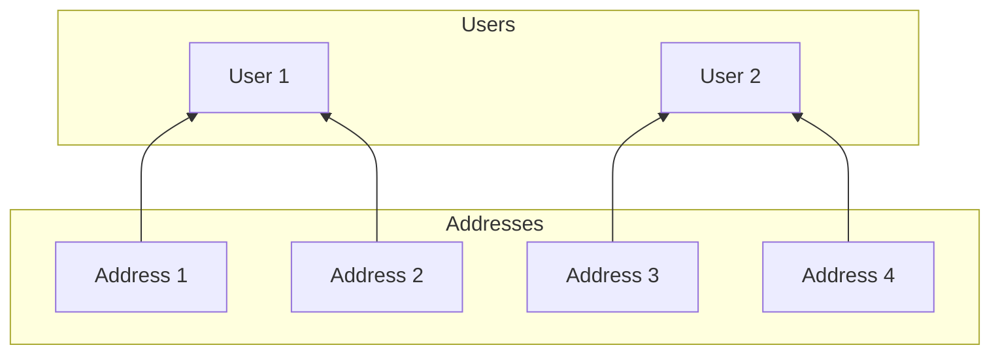
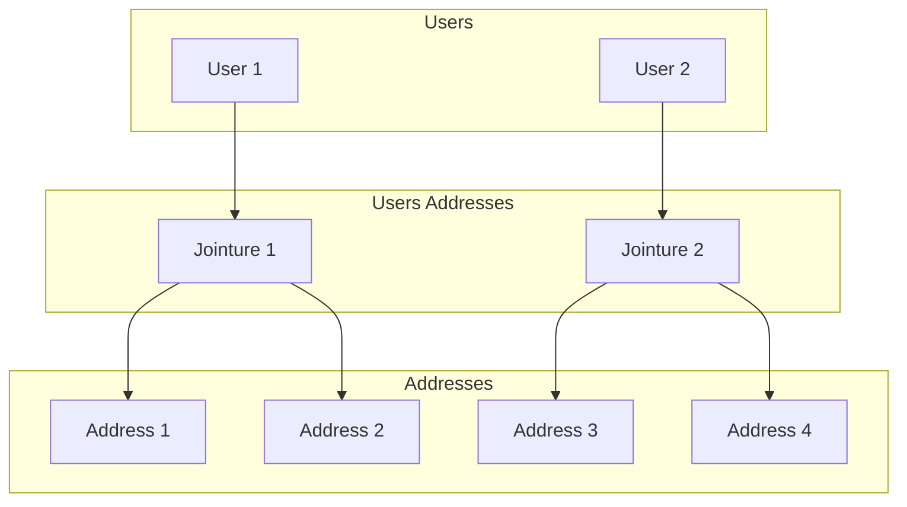
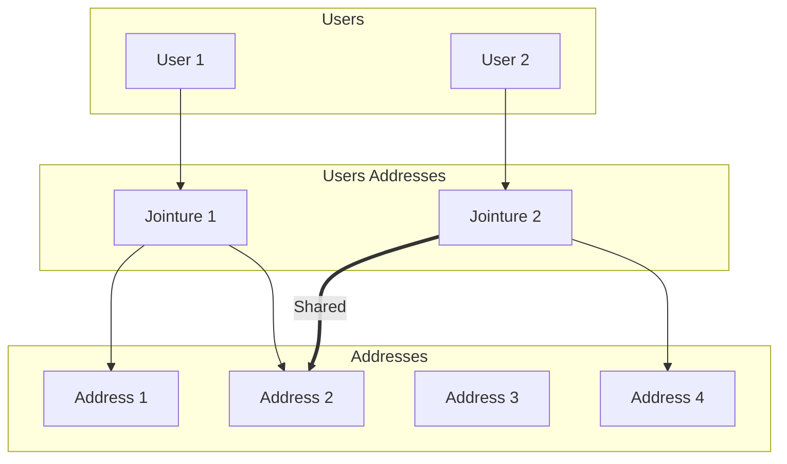
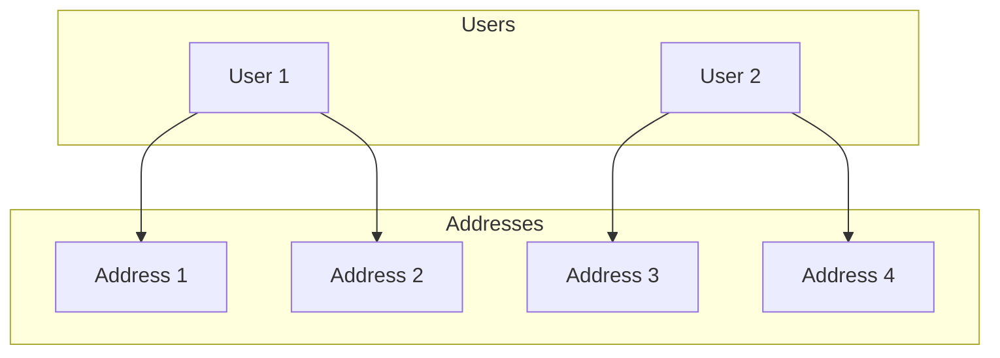
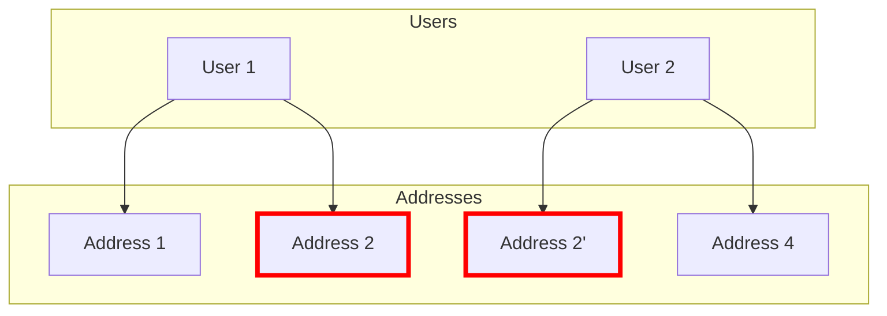
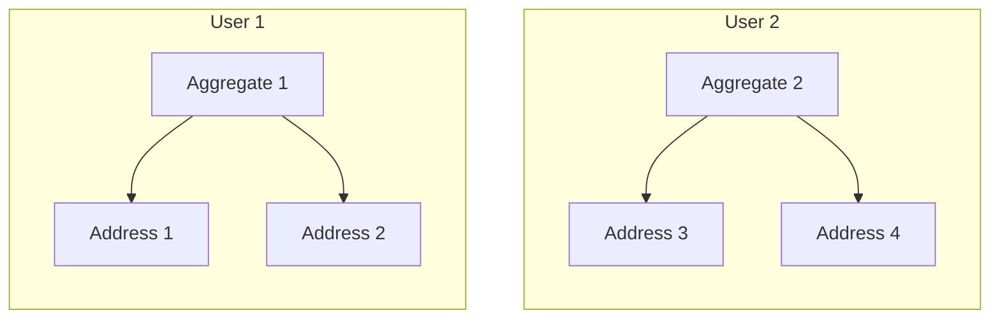

autoscale: true
theme: Fira, 6

## Et si on repensait les ORMs ?

---

[.list: alignment(left)]

- Baptiste Langlade
- Architecte chez Efalia
- Lyon
- ~95 packages Open Source
- 10+ ans XP

---

## Les ORMs ont plus de 10 ans

---

[.list: alignment(left)]

## Il en existe plusieurs

- Doctrine
- Eloquent
- etc...

^ Data Mapper ou Active Record, transition next slide

---

## Ils ont tous le même concept

^ Transformer l'interface SQL en interface Objet

---

## Source des problèmes

^ Une abstraction doit réduire la complexité. Faire un parallèle avec les cartes

---

## Problème 1 : Graphe d'objet

^ Les foreign key sont représentées par des références

---



^ montrer que même les adresses doivent avoir des ids, ref circulaire

---



^ Design objet plus propre

---



^ montrer le problème de cohérence en cas de suppression en cascade

---

---

## Problème 2 : Objets muables

^ Indispensable pour les relations et le compute du diff

---

Sauvegarde accidentelle de données

---

`EntityManagerClosed`

^ dès qu'il y a une erreur pour empêcher de persist des données incohérentes

---

Fuite mémoire

^ Ok en HTTP mais problématique en CLI vie longue

---

En somme :

## on doit gérer un état global

^ Au plus une app grossie au plus c'est complexe et difficile

---

---

## Solutions

^ PHP a beaucoup changé en 10 ans

---

### Domain Driven Design

^ Un aggregat assure la cohérence des objets qu'il référence

---



^ Les utilisateurs ont l'ownership

---



---



^ En somme on passe d'un graphe à un ensemble d'arbre

---

### Programmation Fonctionnelle

^ Immuabilité

---

[.code-highlight: 1]
[.code-highlight: 3]
[.code-highlight: 5-8]
[.code-highlight: 11]
[.code-highlight: 13]
[.code-highlight: 15-18]

```php
final class MutableUser
{
    public function __construct(public string $name) {}

    public function rename(string $name): void
    {
        $this->name = $name;
    }
}

final readonly class ImmutableUser
{
    public function __construct(public string $name) {}

    public function rename(string $name): self
    {
        return new self($name);
    }
}
```

---

```php
$user = new ImmutableUser('alice');
$newUser = doSomething($user);
$user->name; // forcément 'alice'
```

^ On n'utilise que des copies locales des objets, réduit la charge mentale

---

---

## Arrive Formal !

^ Show, don't tell !

---

```sh
composer require formal/orm
```

---

TODO exemple classe aggregate `User` avec juste un nom et une fonction `rename`

^ Immuable

---

TODO exemple de setup de `Manager` mais masquer le storage

^ Détail du storage plus tard

---

TODO exemple de persistence d'un `User`

---

TODO exemple de lister l'ensemble des `User`

^ Lazy + memory safe

---

TODO exemple de maj en masse

---

TODO exemple all + filter

^ Transition sur Specification

---

TODO exemple specification `HaveUsername::of(string)`

---

TODO exemple `matching`

---

TODO introduire `Address`

---

TODO modifier `User` pour montrer les entités, optionals et collections

---

Support de Value Objects possible

---

---

## Avantages

---

### Stockage

---

TODO exemple SQL

^ Ça c'est attendu

---

TODO exemple Filesystem

^ FS concret, en mémoire, S3

---

TODO exemple Elasticsearch

---

Les trois ont exactement le même comportement grâce au property based testing

^ Référence à la conf de 2023

---

### Compatibilité avec Innmind

---

[.list: alignment(left)]

- Génération de fichier
- Body requête/réponse HTTP
- Input de processus
- Envoi de messages AMQP
- Asynchrone

^ Mention qu'on génère des fichiers compressés de plusieurs Go chez Efalia

---

### Performance

---

~40% plus rapide que Doctrine sur lecture/écriture simple

---

### Et plus

TODO QR code vers documentation

---

## Questions


Twitter @Baptouuuu

Github @Baptouuuu/talks
