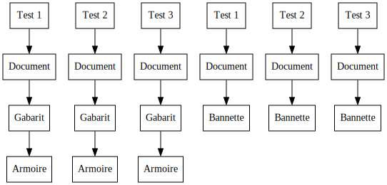
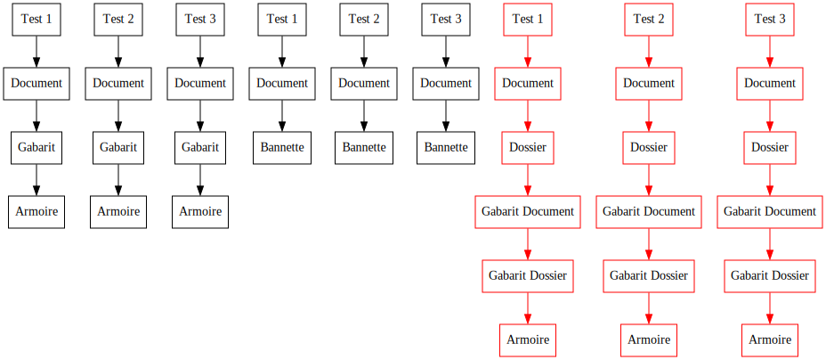
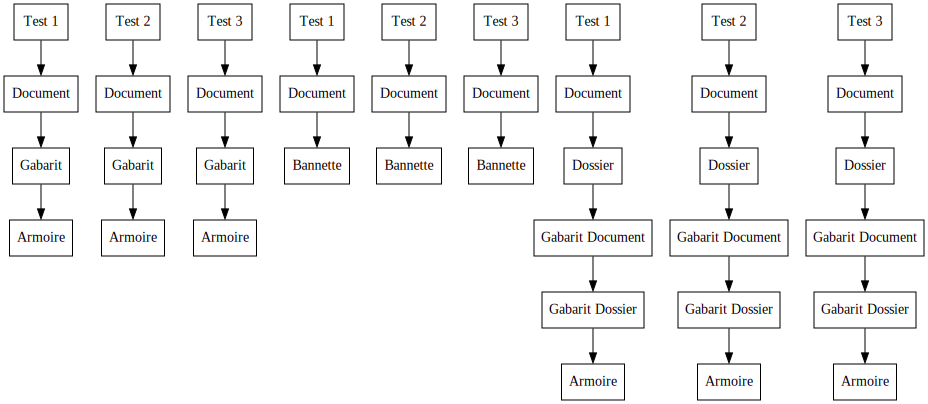
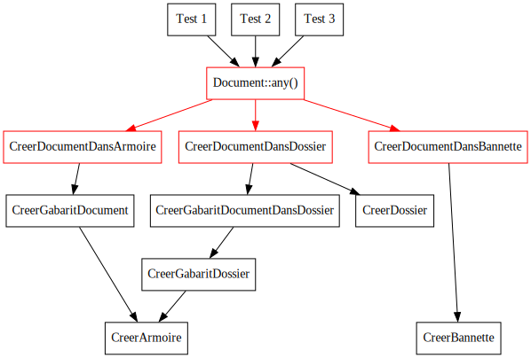

autoscale: true
theme: Fira, 6

## Augmentez votre couverture :
## supprimez des tests !

---

[.list: alignment(left)]

- Baptiste Langlade
- Lyon
- 10+ ans XP
- ~95 packages Open Source

---


^ Efalia Suite

---

## GED

---

[.list: alignment(left)]

- Armoires
    - Gabarits de documents
        - Documents
- Bannettes
    - Documents

---

## Tests fonctionnels

^ 3 devs, déploiement on premise, symfony

---

[.list: alignment(left)]

- Armoires
    - Gabarits de documents
        - **Documents**
- Bannettes
    - **Documents**

^ Tests positifs + négatifs, fonctionnalité verrouillage

---

## Verrouiller document



---

[.list: alignment(left)]

- Armoires
    - Gabarits de documents
        - **Documents**
    - Gabarits de dossiers
        - Dossiers > Gabarits de documents > **Documents**
- Bannettes
    - **Documents**

---

## Verrouiller document



---

[.list: alignment(left)]

## Après 3 ans

- 730 tests (350 positifs, 380 négatifs)
- 1h15 de temps d'exécution

---

## Complexité Exponentielle

^ Soit on abandonne soit on trouve un nouvel outil

---

---

# Property Based Testing

^ Programmation fonctionnelle, aléatoire

---

## Loi de Murphy

^ Loi statistique

---

## Tests locaux & CI

^ Au plus on lance les tests au plus le système est efficace

---

## Tests en dur

---

```php
final class ArmoireTest extends TestCase
{
    public function testCréationArmoire()
    {
        $response = $this->makePost('/api/armoires', [
            'nom' => 'foobar',
        ]);

        $this->assertSame(201, $response->getStatusCode());
    }
}
```

---

[.code-highlight: 5-10]
[.code-highlight: 12-16]
[.code-highlight: 5-10]

```php
final class GabaritDeDocumentTest extends TestCase
{
    public function testCréationGabaritDeDocument()
    {
        $response = $this->makePost('/api/armoires', [
            'nom' => 'foobar',
        ]);

        $this->assertSame(201, $response->getStatusCode());
        $armoire = \json_decode($response->getContent(), true);

        $response = $this->makePost("/api/armoires/{$armoire['id']}/gabarits-de-documents", [
            'nom' => 'baz',
        ]);

        $this->assertSame(201, $response->getStatusCode());
    }
}
```

---

[.code-highlight: 5]

```php
final class GabaritDeDocumentTest extends TestCase
{
    public function testCréationGabaritDeDocument()
    {
        $armoire = $this->créerArmoire('foobar');

        $response = $this->makePost("/api/armoires/{$armoire['id']}/gabarits-de-documents", [
            'nom' => 'baz',
        ]);

        $this->assertSame(201, $response->getStatusCode());
    }
}
```

---

## Données aléatoires

---

```sh
composer require --dev innmind/black-box
```

---

[.code-highlight: 5]
[.code-highlight: 10]
[.code-highlight: 11]
[.code-highlight: 13]

```php
use Innmind\BlackBox\{PHPUnit\BlackBox, Set};

final class ArmoireTest extends TestCase
{
    use BlackBox;

    public function testCréationArmoire()
    {
        $this
            ->forAll(Set\Elements::of('foobar'))
            ->then(function(string $nom) {
                $response = $this->makePost('/api/armoires', [
                    'nom' => $nom,
                ]);

                $this->assertSame(201, $response->getStatusCode());
            });
    }
}
```

---

> Pour toute string entre 1 et 255 caractères je peux créer une armoire

---

[.code-highlight: 8]
[.code-highlight: 9]
[.code-highlight: 11]

```php
final class ArmoireTest extends TestCase
{
    use BlackBox;

    public function testCréationArmoire()
    {
        $this
            ->forAll(Set\Strings::between(1, 255))
            ->then(function(string $nom) {
                $response = $this->makePost('/api/armoires', [
                    'nom' => $nom,
                ]);

                $this->assertSame(201, $response->getStatusCode());
            });
    }
}
```

^ elasticsearch

---

[.code-highlight: 13]
[.code-highlight: 15-19]
[.code-highlight: 12]
[.code-highlight: 9-10]

```php
final class GabaritDeDocumentTest extends TestCase
{
    use BlackBox;

    public function testCréationGabaritDeDocument()
    {
        $this
            ->forAll(
                Set\Strings::between(1, 255),
                Set\Strings::between(1, 255),
            )
            ->then(function(string $nomArmoire, string $nomGabarit) {
                $armoire = $this->créerArmoire($nomArmoire);

                $response = $this->makePost("/api/armoires/{$armoire['id']}/gabarits-de-documents", [
                    'nom' => $nomGabarit,
                ]);

                $this->assertSame(201, $response->getStatusCode());
            });
    }
}
```

^ Double problème, création armoire et génération du nom dupliquée

---

## Tests dynamiques

---

[.code-highlight: 1]
[.code-highlight: 16-21]
[.code-highlight: 3]
[.code-highlight: 5]
[.code-highlight: 7-11]
[.code-highlight: 13]

```php
final class CreerArmoire
{
    public function __construct(private string $nom) {}

    public function __invoke(TestCase $test): array
    {
        $response = $test->makePost('/api/armoires', [
            'nom' => $this->nom,
        ]);

        $test->assertSame(201, $response->getStatusCode());

        return \json_decode($response->getContent(), true);
    }

    public static function any(): Set
    {
        return Set\Strings::between(1, 255)->map(
            static fn($nom) => new self($nom),
        );
    }
}
```

---

[.code-highlight: 8]
[.code-highlight: 9]
[.code-highlight: 10]

```php
final class ArmoireTest extends TestCase
{
    use BlackBox;

    public function testCréationArmoire()
    {
        $this
            ->forAll(CreerArmoire::any())
            ->then(function(CreerArmoire $créerArmoire) {
                $créerArmoire($this);
            });
    }
}
```

---

[.code-highlight: 9]
[.code-highlight: 12]
[.code-highlight: 13]

```php
final class GabaritDeDocumentTest extends TestCase
{
    use BlackBox;

    public function testCréationGabaritDeDocument()
    {
        $this
            ->forAll(
                CreerArmoire::any(),
                Set\Strings::between(1, 255),
            )
            ->then(function(CreerArmoire $créerArmoire, string $nomGabarit) {
                $armoire = $créerArmoire($this);

                $response = $this->makePost("/api/armoires/{$armoire['id']}/gabarits-de-documents", [
                    'nom' => $nomGabarit,
                ]);

                $this->assertSame(201, $response->getStatusCode());
            });
    }
}
```

---

[.list: alignment(left)]

- `CreerArmoire`
- `CreerGabaritDeDocument`
- `CreerDocumentDansArmoire`
- `CreerBannette`
- `CreerDocumentDansBannette`

---

[.list: alignment(left)]

`VerrouillerDocument`

- `CreerDocumentDansArmoire`
- `CreerDocumentDansBannette`

---

[.code-highlight: 1]
[.code-highlight: 14-16]
[.code-highlight: 17]
[.code-highlight: 3]
[.code-highlight: 7]
[.code-highlight: 14-16]

```php
final class VerrouillerDocument
{
    public function __construct(private $créerDocument) {}

    public function __invoke(TestCase $test)
    {
        $document = ($this->créerDocument)($test);

        // reste du test
    }

    public static function any(): Set
    {
        return Set\Either::any(
            CreerDocumentDansArmoire::any(),
            CreerDocumentDansBannette::any(),
        )->map(static fn($créerDocument) => new self($créerDocument));
    }
}
```

---

```php
namespace Fixtures;

final class Document
{
    public static function any(): Set
    {
        return Set\Either::any(
            CreerDocumentDansArmoire::any(),
            CreerDocumentDansBannette::any(),
        );
    }
}
```

---

[.code-highlight: 10-15]

```php
final class VerrouillerDocument
{
    public function __construct(private $créerDocument) {}

    public function __invoke(TestCase $test)
    {
        // implémentation
    }

    public static function any(): Set
    {
        return \Fixtures\Document::any()->map(
            static fn($créerDocument) => new self($créerDocument),
        );
    }
}
```

---

[.code-highlight: 10]

```php
namespace Fixtures;

final class Document
{
    public static function any(): Set
    {
        return Set\Either::any(
            CreerDocumentDansArmoire::any(),
            CreerDocumentDansBannette::any(),
            CreerDocumentDansDossier::any(),
        );
    }
}
```

---



---



---

## Test non régression

---

```php
final class ArmoireTest extends TestCase
{
    public function testNonRégression()
    {
        $créerArmoire = new CreerArmoire('nom invalide');

        $créerArmoire($this);
    }
}
```

---

[.list: alignment(left)]

## Composition

- `Set\Strings::madeOf(...Set)`
- `Set->filter()`
- `Set\Composite(callable, ...Set)`
- etc...

---

---

## Futur

---

### Parcours utilisateur

---

[.code-highlight: 8,14]
[.code-highlight: 9-13]
[.code-highlight: 15-19]

```php
final class SimulationTest extends TestCase
{
    use BlackBox;

    public function testParcoursUtilisateur()
    {
        $this
            ->forAll(Set\Sequence::of(
                Set\Either::any(
                    CreerDocumentDansArmoire::any(),
                    CreerBannette::any(),
                    // etc...
                ),
            )->atLeast(2))
            ->then(function(array $actions) {
                foreach ($actions as $action) {
                    $action($this);
                }
            });
    }
}
```

---

### Tests en conditions réelles

^ Efalia Suite

---

[.code-highlight: 7-9]

```php
final class CreerArmoire
{
    public function __construct(private string $nom) {}

    public function __invoke(TestCase $test): array
    {
        $response = $test->makePost('/api/armoires', [
            'nom' => $this->nom,
        ]);

        $test->assertSame(201, $response->getStatusCode());

        return \json_decode($response->getContent(), true);
    }

    public static function any(): Set
    {
        return Set\Strings::between(1, 255)->map(
            static fn($nom) => new self($nom),
        );
    }
}
```

^ Client HTTP

---

## Model Checker

^ TLA+ / Alloy

---

## 🤫

---

## Questions


Twitter @Baptouuuu

Github @Baptouuuu/talks
